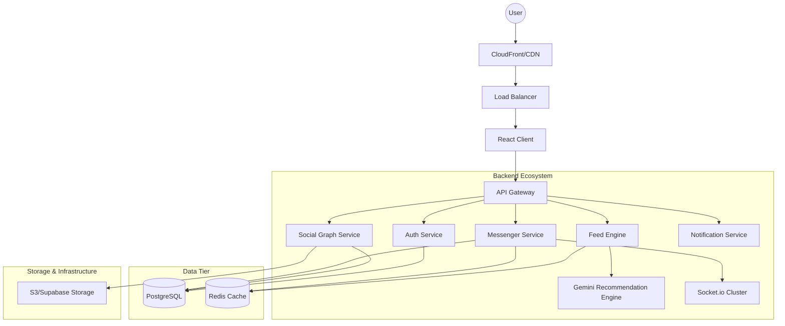

# iTambayan System Architecture

## 1. Overview
iTambayan is a high-scalability social networking ecosystem designed to support millions of concurrent users. It follows a hybrid architecture, combining monolithic efficiency for core services with a transition path towards microservices for specialized high-load components (messenger, feed engine).

## 2. Technical Stack
- **Frontend**: React (v19), TypeScript, Vite, TailwindCSS (v4).
- **State Management**: Zustand (Client State), React Query (Server State).
- **Backend**: Node.js, Express.js, TypeScript.
- **Real-Time**: Socket.io for bi-directional communication.
- **Database**: PostgreSQL (Primary), Redis (Cache/Leaderboard), Firestore (Real-time metadata/Alternative).
- **ORM**: Prisma for type-safe database access.
- **AI**: Gemini 3.5 Flash for recommendation engines and moderation.

## 3. High-Level Architecture

## 4. Scalability Strategy
- **Database Sharding**: Multi-tenancy and horizontal sharding based on user regions.
- **Read Replicas**: Master-Slave configuration for PostgreSQL to handle high read volumes on feeds.
- **Redis Caching**: Caching active user sessions, post counts, and feed fragments.
- **Event-Driven**: Message queues (RabbitMQ/Kafka) for asynchronous tasks like image processing, notification broadcasting, and AI moderation.

## 5. Security Architecture
- **JWT + Fingerprinting**: Double-token strategy (Access + Refresh) with device fingerprinting.
- **Role-Based Access Control (RBAC)**: Fine-grained permissions for users, moderators, and admins.
- **Zero-Trust Rules**: Strict database security rules (Firestore/Supabase) ensuring users can only access their own data.
- **Rate Limiting**: IP-based and user-based throttling to prevent DDoS and scraping.
